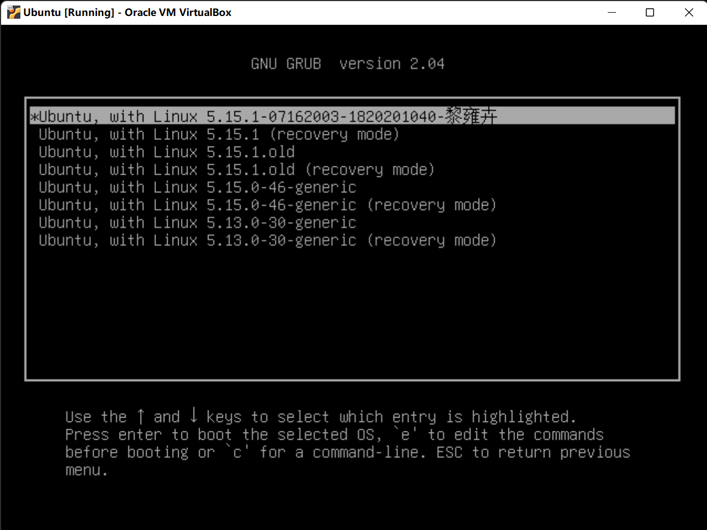

# Installing-Linux-Kernel-In-Ubuntu
#####  <span style="color:grey;">*Installing Linux 5.15.1 Kernel in Ubuntu 20.04.5 of GCC 9.4*</span>

```shell
Version：
Ubuntu 20.04.5 LTS
GCC 9.4.0 
Linux 5.15.1
```


**Errors and problems confronted when doing the installation. 安装出现的问题.**

1. make[1]: [Kbuild:36: kernel/bounds.s] Error 1

   <span style="color:red;">**解决方案：**</span> ```sudo apt-get install lib32z1```

2. make: [Makefile:982: prepare0] Error 2

   <span style="color:red;">**解决方案：**</span>```sudo make menuconfig ARCH=arm CROSS_COMPILE=arm-linux-```

   ​					Kernel Features--> 去掉 'Use the ARM  EABI to compile the kernel' 选项

3. cc1: error: code model kernel does not support PIC mode

   <span style="color:red;">**解决方案：**</span>kernel源代码根目录的 Makefile 中 KBUILDS_CFLAGS 尾部添加一个编译选项 -fno-pie

4. linux/compiler-gcc9.h: No such file or directory

   <span style="color:red;">**解决方案：**</span>将源代码 includes/linux 文件夹下的 compiler-gcc4.h 修改成 compiler-gcc9.h

5. /bin/sh: flex: not found

   <span style="color:red;">**解决方案：**</span>```sudo apt-get install flex```

6. /bin/sh: 1: bison: not found

   <span style="color:red;">**解决方案：**</span>```sudo apt-get install bison```

7. fatal error: openssl/opensslv.h: No such file or directory

   <span style="color:red;">**解决方案：**</span>```sudo apt-get install libssl-dev```

8. fatal error: libelf.h: No such file or directory

   <span style="color:red;">**解决方案：**</span>```sudo apt-get install libelf-dev```

9. make[1]: No rule to make target 'debian/canonical-certs.pem', needed by 'certs/x509_certificate_list'.  Stop.

   <span style="color:red;">**解决方案：**</span>编辑.config文件，```sudo gedit .config```
   	               置空文件中的参数 ```CONFIG_SYSTEM_TRUSTED_KEYS = ""```
   	               或执行 ```sudo scripts/config --set-str SYSTEM_TRUSTED_KEYS ""```

10. make[1]: No rule to make target 'debian/canonical-revoked-certs.pem', needed by 'certs/x509_revocation_list'.  Stop.

    <span style="color:red;">**解决方案：**</span>执行 ```sudo scripts/config --disable SYSTEM_REVOCATION_KEYS```

11. BTF: .tmp_vmlinux.btf: pahole (pahole) is not available
    Failed to generate BTF for vmlinux
    Try to disable CONFIG_DEBUG_INFO_BTF

    <span style="color:red;">**解决方案：**</span>```sudo apt-get install dwarves```
          

12. rch/x86/Makefile:142: CONFIG_X86_X32 enabled but no binutils support
    sh ./arch/x86/boot/install.sh 5.15.1 \
    arch/x86/boot/bzImage System.map "/boot"
    Missing file: arch/x86/boot/bzImage  

    <span style="color:red;">**解决方案：**</span> 

    ```shell
    sudo apt-get install binutils     
    make bzImage
    sudo make install
    sudo update-grub
    ```

    

13. bin sh 1 zstd not found

    <span style="color:red;">**解决方案：**</span>```sudo apt install zstd```

14. 跨平台问题

    ```shell
    sudo apt install qemu-system-arm \        # qemu
    	binutils-aarch64-linux-gnu \     # objdump等二进制工具
    	gcc-8-aarch64-linux-gnu \        # gcc
    	g++-8-aarch64-linux-gnu \        # g++ 这个编译内核并不是必须的
    	gdb-multiarch                    # 多平台gdb 
    ```

    ​      

    

#### **Installation Steps 安装步骤**

1. **#check version**

   ```shell
   lsb_release -a     #Ubuntu version 20.04.5
   gcc --version      #GCC version 9.4.0
   uname -r           #Linux Kernel version 5.15.0-46-generic
   ```

2. **#get linux kernel which matches the version of ubuntu and gcc version above from official website (for here i choose Linux 5.15.1 as my kernel)**

   ```wget https://www.kernel.org/pub/linux/kernel/v5.x/linux-5.15.1.tar.xz```

3. ```sudo cp ./linux-5.15.1.tar.xz /usr/src```

4. ```cd /usr/src```

5. ```sudo tar xvJf ./linux-5.15.1.tar.xz```

6. ```cd ./linux-5.15.1```

7. **#install ncurses**

   ```sudo apt install libncurses5-dev openssl libssl-dev build-essential pkg-config libc6-dev bison flex libelf-dev zlibc minizip libidn11-dev libidn11 kernel-package```

8. ```sudo make menuconfig```  **#打开配置菜单**

9. ```sudo make -j $(nproc)```    **#以最大线程数并发编译内核，nproc 最大线程数**

10. ```sudo make modules_install```   **#安装模块** 

11. ```sudo make install```   **#安装内核**

12. **#修改引导菜单配置**

    找到 etc/default/grub，运行命令 ```sudo gedit grub```，编辑 GRUB 在启动引导时的菜单选项

    注释掉或删除 ```GRUB_TIMEOUT_STYLE=hidden```

    修改 ```GRUB_TIMEOUT=30```

    修改 ```GRUB_CMDLINE_LINUX_DEFAULT="text" ```

    ```sudo update-grub```

13. 找到 boot/grub/grub.cfg，运行命令 ```sudo gedit grub.cfg``` 修改引导菜单, 添加班号 学号 姓名 

    重启，即可看到引导菜单

    要求在启动菜单里看到每个人自己的班号、学号、姓名及版本号


